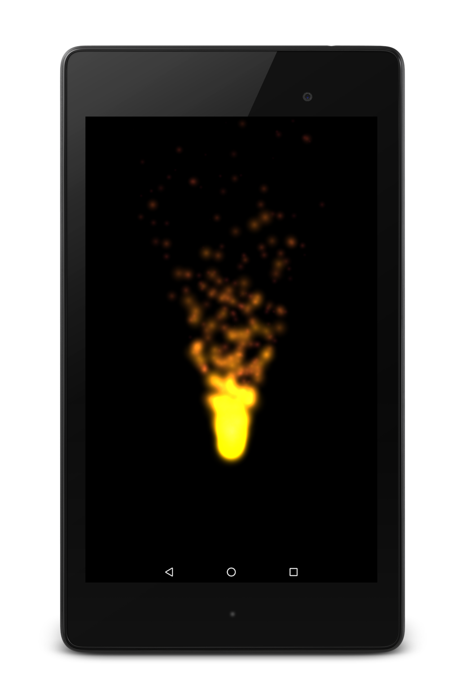
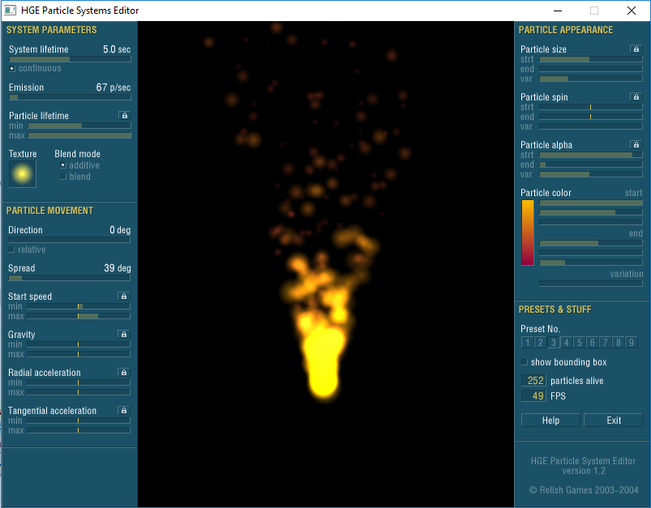

# Hummingbird Game Engine
Hummingbird Game Engine, a high-efficiency 2D game engine for Android platform.

A few key features are highlighted here:
- To the best of our knowledge, this is the most efficient graphic engine in drawing a large number of small sprites on the screen of a mobile device.
- The grammars of resource scripts are compatible with Haaf's Game Engine (HGE), a desktop 2D game engine. You can use existing tools from HGE to organize your textures, create fonts, design particle systems. The resource scripts files can be read by Hummingbird.
- A package tool is provided to help you put all your images assets in one file. You can use virtual paths to access images in the file, as easy as you read the file by a path in a folder.

This game engine is designed based on the idea of batch rendering. We refer the idea from classic desktop computer 2D Game Engine ["Haaf's Game Engine (HGE),"](https://sourceforge.net/projects/hge/) and some other similar engines, such as [Cocos2d-x](http://www.cocos2d-x.org/). The basic graphic renders in conventional windows PC lay on DirectX. The motivation of the development is to design a fast 2D engine on Android platform. The traditional graphic rendering on Android is not fast enough for video games. We studied algorithms in desktop PC engines, then designed an engine based on OpenGL ES, that can efficiently run on Android platform.

A comparison of performance for the Hummingbird Game Engine and other Engines can be found in my another repository ["SpriteTest."](https://github.com/minicpp/SpriteTest) We compare the performance in terms of FPS under different number of sprites drawn on the screen tested on 3 engines: Hummingbird, Cocos2d-x, and Android:

The Hummingbird game engine has been used in the development of 2 published games on Android.

- AdventRush, a bullets curtain game. This game shows the power of the engine in rendering a large number of dynamic bullets on the screen smoothly, even on low-end mobile devices.

- Kapow, a social networking game, used to trick your friends. This game shows the efficiency of the engine in drawing multiple background layouts and animations.

Hummingbird Engine has convenient particle systems. Developers can design particle effects on desktop PC using an existing tool. We design the particle systems to be compatible with HGE particle editor. Hummingbird Engine can read HGE particle script, then draw the same particle effect on mobile devices. It is pretty easy for you to design a particular effect on PC, by adjusting different parameters. Then save the script file and export it to the mobile game development.

To design a particle as shown on the mobile device:

To achieve a particle effect as shown above, you can use HGE particle systems editor on PC. Then export the script file to be read by Hummingbird.

A packaging tool is provided to easily aggregate assets. The screenshot of the package tool is shown as below.

Because the package tool is developed by C# in Visual Studio long time ago, the source code has lost. However, it is not hard to do reverse engineering to get the encoding algorithm. For the file decoding algorithm, you can find it in the source file "game.hummingbird.core.HbEngine.java".

